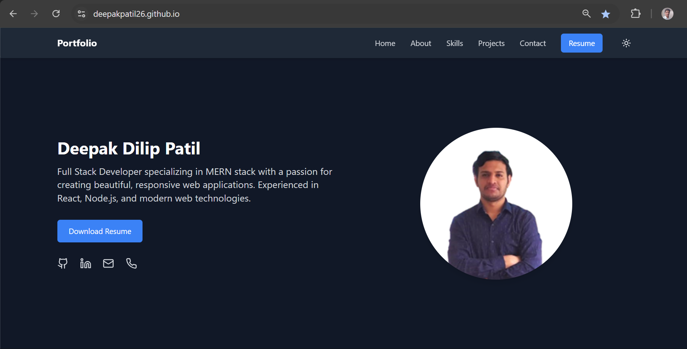

# 🚀 Personal Portfolio Website

## 📋 Overview

This is a cutting-edge personal portfolio website crafted with modern web technologies, showcasing my skills, projects, and professional journey. Built using React and Vite, it represents a performant and dynamic representation of my work.

## 🌟 Key Features

- **Modern Technology Stack**: Developed with React and Vite for blazing-fast performance
- **Responsive Design**: Seamlessly adapts to all device sizes and screen resolutions
- **Smooth Animations**: Elegant transitions and interactive elements
- **Clean, Minimalist UI**: Focusing on content and user experience

## 🛠 Technologies Used

- React.js
- Vite
- JavaScript (ES6+)
- HTML5
- CSS3
- Responsive Design Principles

## 🚀 Getting Started

### Prerequisites

- Node.js (v16.0.0 or later)
- npm (v8.0.0 or later)

### Installation Steps

1. Clone the repository:

```bash
   git clone https://github.com/deepakpatil26/DeepakPatil26.github.io
   ```

2. Navigate to the project directory:

```bash
   cd your-portfolio
   ```

3. Install dependencies:

```bash
   npm install
   ```

4. Start the development server:

```bash
   npm run dev
   ```

5. Open your browser and visit http://localhost:5173

## 🏗 Production Build

Generate a production-ready build with:

```bash
npm run build
```

Optimized files will be generated in the `dist` folder, ready for deployment.

## 🌐 Deployment

Recommended platforms for deployment:
- Netlify
- Vercel
- GitHub Pages


## 📸 Screenshots



## 🤝 Contributing

Contributions, issues, and feature requests are welcome! Feel free to check [issues page](https://github.com/deepakpatil26/DeepakPatil26.github.io/issues).

## 📜 License

This project is [MIT](https://choosealicense.com/licenses/mit/) licensed.

## 🎉 Show Your Support

Give a ⭐️ if this project helped you!

---

**Built with ❤️ by Deepak Patil**