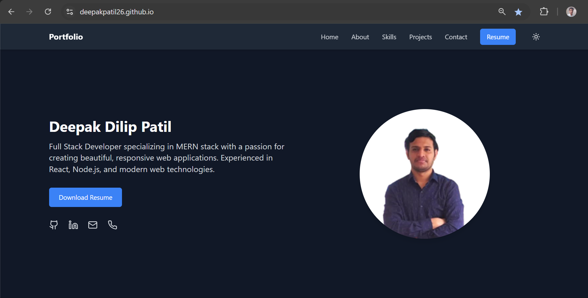

# 🚀 AI-Enabled Full Stack Portfolio | Deepak Patil

## 📋 Overview

This is a cutting-edge personal portfolio website rebranded for the AI era. It showcases my transition from a traditional Full Stack Developer to an **AI-Enabled Software Engineer**, highlighting my expertise in building intelligent applications using Generative AI, RAG (Retrieval-Augmented Generation), and modern cloud architectures.

## 🌟 Key Features

- **AI-Focused Showcase**: Dedicated sections for intelligent applications like DocuNova and CodeClarity Pro.
- **Modern Technology Stack**: Built with **React 18**, **Vite**, and **TypeScript** for maximum performance.
- **AI Integration**: Features implementations of **OpenAI**, **Gemini AI**, and **LangChain**.
- **Responsive & Mobile-First**: Optimized for a perfect experience across all devices and screen sizes.
- **Glassmorphic UI**: Sleek, modern design with support for both Light and Dark modes.

## 🛠 Technologies Used

- **Frontend**: React, TypeScript, Tailwind CSS, Framer Motion, Lucide React
- **AI/ML**: OpenAI API, Gemini API, LangChain, RAG Architecture
- **Backend/DB**: Node.js, PostgreSQL, Supabase, Firebase, Qdrant (Vector DB)
- **Tools**: Vite, Git, GitHub Actions, EmailJS

## 🚀 Getting Started

### Prerequisites

- Node.js (v16.0.0 or later)
- npm (v8.0.0 or later)

### Installation Steps

1. Clone the repository:

```bash
   git clone https://github.com/deepakpatil26/DeepakPatil26.github.io
```

2. Navigate to the project directory:

```bash
   cd your-portfolio
```

3. Install dependencies:

```bash
   npm install
```

4. Start the development server:

```bash
   npm run dev
```

5. Open your browser and visit [http://localhost:5173](http://localhost:5173)

## 🏗 Production Build

Generate a production-ready build with:

```bash
npm run build
```

Optimized files will be generated in the `dist` folder, ready for deployment.

## 🌐 Deployment

The portfolio is deployed to **GitHub Pages**.

- **URL**: [https://deepakpatil26.github.io/](https://deepakpatil26.github.io/)
- **Command**: Deploy manually using `npm run deploy`

## 📸 Screenshots



## 🤝 Contributing

Contributions, issues, and feature requests are welcome! Feel free to check [issues page](https://github.com/deepakpatil26/DeepakPatil26.github.io/issues).

## 📜 License

This project is [MIT](https://choosealicense.com/licenses/mit/) licensed.

## 🎉 Show Your Support

Give a ⭐️ if this project helped you!

---

### Built with ❤️ by Deepak Patil
